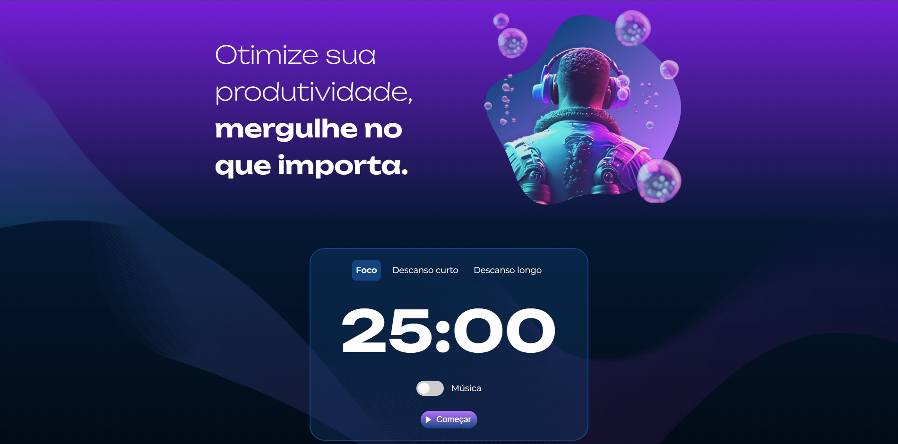

# 🎯 Fokus - Temporizador Pomodoro

 
O **Fokus** é uma aplicação de gerenciamento de tempo baseada na técnica Pomodoro. Desenvolvido durante o curso de JavaScript da **Alura**, o projeto foca na criação de uma interface dinâmica onde o usuário pode alternar entre períodos de concentração extrema e descansos recuperadores.

O objetivo principal foi aplicar conceitos avançados de manipulação do **DOM (Document Object Model)** para criar uma experiência de usuário fluida e interativa.

---

## ✨ Funcionalidades
* **🕒 Três Modos de Temporizador:** Alternância entre Foco (25min), Descanso Curto (5min) e Descanso Longo (15min).
* **🎨 Interface Adaptativa:** Troca dinâmica de fundos, imagens e frases motivacionais ao mudar o contexto.
* **🎵 Ambientação Sonora:** Opção de música relaxante de fundo para auxiliar na concentração.
* **🔔 Alertas Auditivos:** Sons de feedback ao iniciar, pausar ou finalizar o ciclo do temporizador.
* **🖱️ Controle Total:** Botão interativo para iniciar e pausar a contagem regressiva conforme a necessidade.

---

## 📸 Demonstração


<div align="center">
  
  <p><em>Interface do modo de foco com temporizador ativo.</em></p>
</div>

---

## 🛠️ Tecnologias Utilizadas
O projeto foi construído puramente com tecnologias web fundamentais:

* **HTML5:** Estrutura semântica dos elementos.
* **CSS3:** Estilização moderna utilizando Variáveis CSS e Seletores de Atributos (`data-contexto`).
* **UI/UX:** Responsividade do sistema, permitindo que usuários de diferentes telas tenham experiências e qualidade sensacionias!
* **JavaScript (Vanilla):** Lógica de programação e manipulação de eventos.

### 🧠 Conceitos de JavaScript Aplicados:
* `querySelector` e `querySelectorAll` para seleção de elementos.
* `addEventListener` para escuta de eventos (click, change).
* `setInterval` e `clearInterval` para o motor do cronômetro.
* Objeto `Audio()` para reprodução de mídias sonoras.
* Métodos `classList` e `setAttribute` para dinamismo visual.

---

## 🚀 Como rodar o projeto localmente

1.  **Clone o repositório:**
    ```bash
    git clone [https://github.com/GustavoGarcia1010/Fokus](https://github.com/GustavoGarcia1010/Fokus)
    ```
2.  **Acesse a pasta do projeto:**
    ```bash
    cd fokus
    ```
3.  **Abra o arquivo principal:**
    Basta abrir o arquivo `index.html` em seu navegador de preferência ou utilizar a extensão **Live Server** do VS Code.

---

## 🤝 Créditos
Este projeto foi desenvolvido como parte do currículo da **Alura**. 
* **Design & Assets:** Alura.
* **Desenvolvimento:** [GUSTAVO VÉRI]

---
<p align="center">Desenvolvido com 💜 para fins de estudo.</p>
